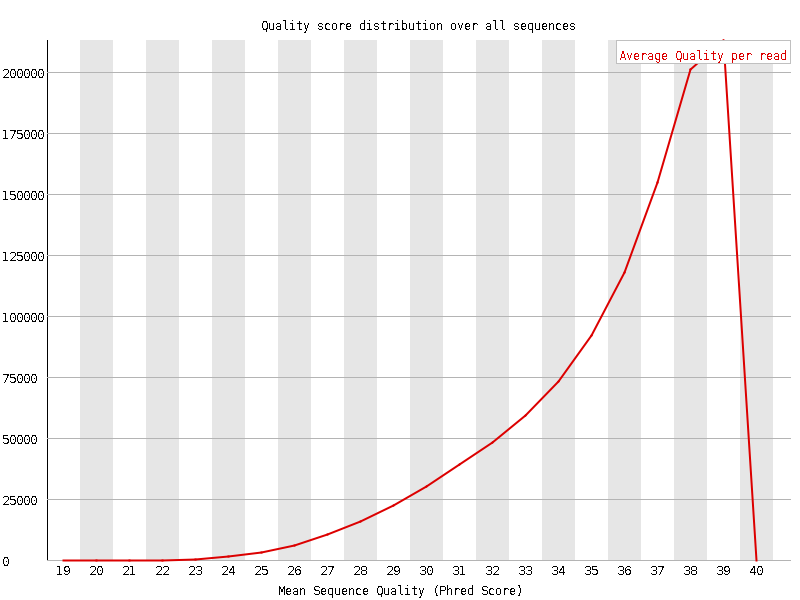
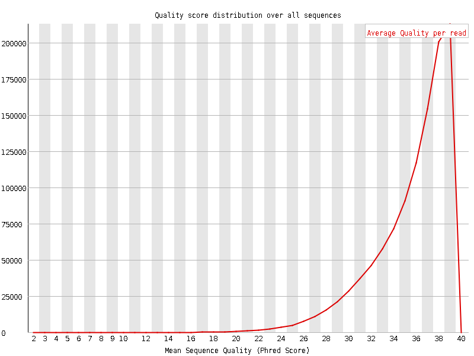
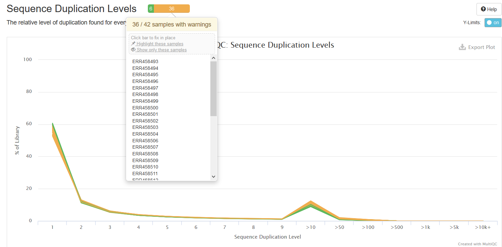

```{r setup, include=FALSE}
knitr::opts_chunk$set(echo = TRUE)
```

##Questions
###1. Which base call is more likely to be incorrect - one with a Phred score of # or one with a Phred score of ; ?
A Phred score of "#" is more likely to be incorrect. Noticed that only Phred33 have score "**#**" and "**;**". In Phred33, "**#**" represents ASCII code **35** and Q value **2**, which means error probability of **0.63**, while "**;**" represents **59** and Q value **26**, which means a lower error probability of **0.00251**.

###2. Explain at least 2 reasons for base calling uncertainties and how they can be avoided/alleviated.
a. Interfering signals from neighbouring clusters. This is hard to be 100% avoided but lower the amount of DNA loaded on lanes can alleviate the noise, while ensuring the minimum concentration for sequencing.

b. Decaying chemicals which would affect the nucleotides binding efficiency, fluorescence group cleavage efficiency etc. Inspect the machine and reload fresh reaction agents every work would help alleviate the problem.

###3. What is the baseline uncertainty that Illumina attaches to its base calls? In other words, how likely is it that a base call is wrong even if it got the highest possible Phred score of 41? How many bases can you therefore expect to be wrong in a file with 1 million 50bp-long reads? Does this concern you?
Since the highest Phred score is 41, we transform it back to error probability as below.

```{r}
#-10*log(P) = Q (Phred without offset)
Phred = 41
(Prob = 10^(-Phred/10))
```

The result shows a error rate of **7.94\*10^(-5)**.

A million 50bp-long reads totally have 10^6 \* 50 = 5 \* 10^7 bases.

```{r}
read_no = 10^6
read_len = 50
total_base = read_no * read_len
(error_base = total_base * Prob)
```

Given the error rate above, we have **3972** error bases in total. This would not concern me because it is a relative small error rate when thinking of SNPs make up 0.1% in a person's genome. And the base call error could be adjusted with a relative high read depth.

##Exercises
###1. Download more FASTQ files from the Gierlinski data set so that you have all the technical replicates for 3 WT and 3 SNF2 samples (6*7 FASTQ files). Place each set of 7 technical replicates into one sensibly named folder respectively.

a. Transfer the **mapping.tsv** and file **address.txt** that contains urls from Week3.  
`mkdir Week4`  
`cd ../Week3`  
`cp mapping.tsv address.txt ../Week4`  
`cd ../Week4`  

b. Write a script to extract all sample names for WT and for SNF2 and store them into separate files called **WT_samples.txt** and **SNF2_samples.txt**.  
`egrep 'WT' mapping.tsv | cut -f 1 > WT_samples.txt`   
`egrep 'SNF' mapping.tsv | cut -f 1 > SNF_samples.txt`  

c. Choose the first 3 samples for WT and first 3 for SNF2. Notice that each sample has 7 replicates, for each sample I create a directory and download the corresponding 7 files for it.
For each WT sample and SNF2 sample, use `sed -n a,bp <input_file>` command to read a~b lines in <input_filel>. Here each iteration from 1 to 3, simply extract 7 continous fastq files which are all the technical replicates for one sample. For example, for WT samples, the script would extract No. 1-7, 8-14, 15-21 fastq files in **WT_samples.txt**. Write a script as following and run it.  

```{}
for((i=1;i<=3;i++))
do
  mkdir -p WT_${i}
  cd WT_${i}
  WT_names=$(sed -n $(((${i}-1)*7+1))),$(((${i}-1)*7+7)))p ../WT_samples.txt)
  
  for Wname in ${WT_names}
  do
    egrep "${Wname}" ../address.txt | xargs wget
  done
  
  cd ../
  
  mkdir -p SNF2_${i}
  cd SNF2_${i}
  SNF_names=$(sed -n $(((${i}-1)*7+1))),$(((${i}-1)*7+7)))p ../SNF_samples.txt)
  
  for Sname in ${SNF_names}
  do
    egrep "${Sname}" ../address.txt | xargs wget
  done
  
  cd ../
  
done
```

This yields 6 folders, each contains 7 fastq files. The folders are WT_1, WT_2, WT_3 and SNF2_1, SNF2_2, SNF2_3.

###2. Write a for-loop that will run FastQC on all (6*7) of the FASTQ files that you previously downloaded from the Gierlinski dataset. Select one sample for which you write an additional for-loop that will:
I. run TrimGalore
II. run FastQC on the trimmed datasets.

a. Load fastqc and then use for-loop to traverse all the fastq files in each folde. The result will be stored in folder **FastQC_results** within in each sample's own folder. Write a script as following and run it.  

```{}
spack load fastqc
for f in WT_1 WT_2 WT_3 SNF2_1 SNF2_2 SNF2_3
do
  cd ${f}
  mkdir FastQC_results
  
  for fastq in ${ls}  
  do
    fastqc -o FastQC_results ${fastq} --extract
  done
  
  cd ../ 
done
```

b. Choose WT_1 to run **TrimGalore**. Write a script as following and run it.  

```{}
spack load -r trimgalore
cd WT_1
for fastq in $(ls | egrep 'ERR')
do
trim_galore --illumina ${fastq}
done
cd ../
```

###3. Describe one detail of the QC results that changes after TrimGalore and one result that stays the same and explain why.
One of what have changed is **Per sequence quality scores**. In the original file, we can see from the FastQC report that the peak around score=38 is relative wide (Figure 1), while after trimming the peak is much narrow around 39. This means trim_galore does help trimming sequences with a low average quality under a threshold of 20, thus improves the total quality of the sample.  



  
  



One result stay the same is the **Per base sequence quality**. The figures before and after trimming are almost the same, which means the sample data itself has a low quality. Something wrong may happen during the sample preparation or with the sequencer.


###4. Combine the initial FastQC results for all 6*7 FASTQC files into one document using MultiQC. Export one image of either of the results where the SNF2 samples are highlighted in a different color than the WT samples and add it to this report.

First load software multiqc, then transfer all the FastQC report under the same folder. Run multiqc and it will search through the directory and combining reports it finds. The log on the screen indicates that 42 reports found, which is the correct number.

`spack load -r py-multiqc`  
`mkdir FastQC_raw`  
`cd FastQC_raw`  
`for f in WT_1 WT_2 WT_3 SNF2_1 SNF2_2 SNF2_3;`  
`do cp ../${f}/FastQC_results ./${f};`  
`done;`  

I found that in the figure **Sequence Duplication Levels**, almost all the SNF2 samples fail the duplication level test, which means they have a relatively high duplication level compare to the WT.  




###5. Based on the QC, would you be justified in combining any of the FASTQ files given that they are technical replicates?
I don't think it is a good idea to combind all the FASTQ files of technical replicates for a certain sample. When I carelly inspect all of the seven FastQC reports for technical replicates of WT_1, I can see that there are differences between these replicates. In the case of WT_1, all the files fail the **Per base sequence content**, almost all fail the **Per tile sequence quality** except two get a warning and even one file get a warning on **Per base N content** but other pass. These results suggest that if the major of files has the same problem, combining all the files would not rescue the problem since the "good" samples just make up a small portion.

###6. Even if the answer to the previous question is "no", what commands would you use to combine the several FASTQ files into one?
Carefully select which files we choose to combine based on the total quality control results. We can first pre-set that each samples should have the same amount of files to be combined. Then by inspecting the FastQC report, choose those with the highest quality, then combine them.

###7. If you had to determine the version of the Sanger quality score encoding used in a given FASTQ file without the help of FastQC, what would you do?
We can simply calculate the **maximum average ASCII of sequence** for a given FASTQ file. First transform the quality scores into ASCII according to Phred33, Phred64 or other score system. Then for each sequence, sum all the ASCII and divided by length of the sequence. Find the maximum of the average ASCII among all sequences. We assume that the data is of relatively good quality, which means a quality score greater than 30.

If the maximum falls in the range of [63, 74], then the data is encoded by Phred33; if it falls in the range of [94,105], then it is encoded by Phred64. It is also important to check if there is ASCII between 33 and 63, which indicates Phred33, and if there is ASCII between [75, 105], which indicates Phred64.

##Project work
###1. Expand your project ideas. Come up with at least one specific hypothesis that you want to test.

###2. Specify the data you will need.
a. Locate potential datasets and describe them.
b. Think about possible biase or technical problems that you might run into if you were to use these data.
